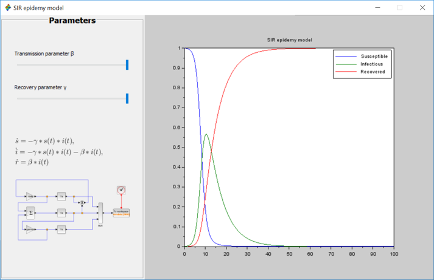

# covid
This application provides basic intel on the analytics of the spread of the virus per country, as well as a [Compartmental model in epidemiology](https://en.wikipedia.org/wiki/Compartmental_models_in_epidemiology) called SIR (for Susceptible, Infectious & Recovered)

